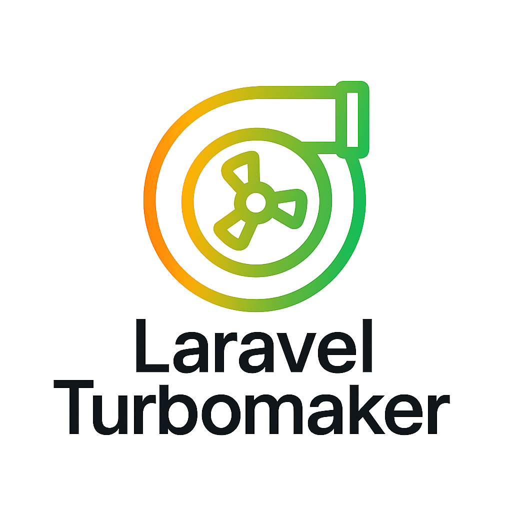

# Laravel TurboMaker



Supercharge your Laravel development workflow with instant module scaffolding.

[](https://packagist.org/packages/grazulex/laravel-turbomaker)
[](https://packagist.org/packages/grazulex/laravel-turbomaker)
[](https://github.com/Grazulex/laravel-turbomaker/blob/main/LICENSE.md)
[](https://php.net/)
[](https://laravel.com/)
[](https://github.com/Grazulex/laravel-turbomaker/actions)
[](https://github.com/laravel/pint)

---

Laravel **TurboMaker** is a productivity-focused package designed to **save hours of repetitive setup work**.  
With a single command, you can scaffold complete modules (models, migrations, controllers, routes, tests, views, policies, factories...) following **Laravel best practices**.

---

## ✨ Features

- **⚡ One-command scaffolding** – Generate a full CRUD or API module instantly
- **📋 Schema-based generation** – Define models with YAML schemas for complex projects
- **📦 Complete structure** – Models, controllers, migrations, requests, resources, views & tests
- **🔒 Security ready** – Generates Policies and authentication hooks out of the box
- **🧪 Built-in testing** – Pest tests automatically generated for each action
- **🔌 Extensible field types** – 28+ built-in types + create custom field types
- **⚙️ Advanced generators** – Actions, Services, Rules, Observers for clean architecture
- **🎨 Custom templates** – Override stubs and templates to match your coding style
- **🌐 API & Web ready** – Separate API Resources & Controllers when needed
- **🚀 Laravel 11+ compatible** – Auto-detection and smart configuration

---

## 📦 Installation

```bash
composer require --dev grazulex/laravel-turbomaker
```

**Requirements**:
- PHP 8.3+
- Laravel 11.x | 12.x

---

## 🚀 Quick Start

### Generate Complete Module
```bash
php artisan turbo:make Post
```

**What's Generated:**
- **Model**: `app/Models/Post.php` with relationships
- **Controllers**: Web & API controllers with CRUD operations
- **Migrations**: Database table with proper columns and indexes
- **Form Requests**: Validation for Store/Update operations
- **API Resources**: JSON transformations for API responses
- **Views**: Complete CRUD views (index, create, edit, show)
- **Routes**: Both web and API routes with correct naming
- **Tests**: Feature and unit tests using Pest framework
- **Factory**: Model factory for testing and seeding

### Schema-Based Development
```bash
# Create a schema file
php artisan turbo:schema create Product --fields="name:string,price:decimal,category_id:foreignId"

# Generate from schema
php artisan turbo:make Product --schema=Product
```

### API-First Development
```bash
php artisan turbo:api Product --tests --policies
```
Generates API-only components (no views) with authentication and authorization.

### Add Relationships
```bash
php artisan turbo:make Comment --belongs-to=Post --belongs-to=User
```
Automatically handles foreign keys, model relationships, and form integration.

---

## � Documentation & Examples

> **📖 Complete documentation and examples have been moved to the [GitHub Wiki](https://github.com/Grazulex/laravel-turbomaker/wiki)**

### Quick Links:

| Section | Description |
|---------|-------------|
| **[🚀 Getting Started](https://github.com/Grazulex/laravel-turbomaker/wiki/Getting-Started)** | Installation, setup and your first module |
| **[📋 Command Reference](https://github.com/Grazulex/laravel-turbomaker/wiki/Commands)** | Complete command documentation |
| **[🔗 Working with Relationships](https://github.com/Grazulex/laravel-turbomaker/wiki/Relationships)** | Model relationships guide |
| **[🎨 Custom Templates](https://github.com/Grazulex/laravel-turbomaker/wiki/Custom-Templates)** | Customize generated code |
| **[⚙️ Configuration](https://github.com/Grazulex/laravel-turbomaker/wiki/Configuration)** | Configure TurboMaker settings |
| **[🏢 Advanced Usage](https://github.com/Grazulex/laravel-turbomaker/wiki/Advanced-Usage)** | Complex patterns and enterprise features |
| **[💡 Real-World Examples](https://github.com/Grazulex/laravel-turbomaker/wiki/Examples)** | Blog, E-commerce, API projects |

---

## 🔍 Available Commands

| Command | Purpose | Example |
|---------|---------|---------|
| `turbo:make {name}` | Generate complete module | `turbo:make Post --tests --factory` |
| `turbo:api {name}` | API-only module | `turbo:api Product --policies --tests` |
| `turbo:schema {action}` | Manage YAML schemas | `turbo:schema create Product --fields="name:string"` |
| `turbo:view {name}` | Views only | `turbo:view Product` |
| `turbo:test {name}` | Tests only | `turbo:test User --feature --unit` |

### Key Options

| Option | Description |
|--------|-------------|
| `--schema=Product` | Use YAML schema for generation |
| `--fields="name:string,email:email"` | Quick field definition |
| `--tests` | Generate Pest tests |
| `--factory` | Generate model factory |
| `--seeder` | Generate seeder |
| `--policies` | Generate policies |
| `--actions` | Generate action classes |
| `--services` | Generate service classes |
| `--rules` | Generate validation rules |
| `--observers` | Generate model observers |
| `--belongs-to=User` | Add belongs-to relationship |
| `--has-many=Comment` | Add has-many relationship |
| `--force` | Overwrite existing files |

---

## 🛠 Configuration

Publish the configuration file to customize TurboMaker:

```bash
php artisan vendor:publish --tag=turbomaker-config
```

Publish custom templates:

```bash
php artisan vendor:publish --tag=turbomaker-stubs
```

See the [Configuration Wiki](https://github.com/Grazulex/laravel-turbomaker/wiki/Configuration) for complete details.

---

## 🎯 Field Types & Extensibility

TurboMaker includes **28+ built-in field types** and supports custom field type creation:

### Built-in Types
**String Types**: `string`, `text`, `longText`, `mediumText`  
**Integer Types**: `integer`, `bigInteger`, `unsignedBigInteger`, `tinyInteger`, `smallInteger`  
**Numeric Types**: `decimal`, `float`, `double`, `boolean`  
**Date/Time**: `date`, `dateTime`, `timestamp`, `time`  
**Special Types**: `json`, `uuid`, `email`, `url`, `foreignId`, `morphs`, `binary`

### Custom Field Types
Create your own field types by extending `AbstractFieldType`:

```php
// config/turbomaker.php
'custom_field_types' => [
    'money' => App\TurboMaker\FieldTypes\MoneyFieldType::class,
    'slug' => App\TurboMaker\FieldTypes\SlugFieldType::class,
],
```

See the [Field Types Wiki](https://github.com/Grazulex/laravel-turbomaker/wiki/Field-Types) for complete documentation.

---

## 🆕 Version Compatibility

| TurboMaker | PHP | Laravel |
|------------|-----|---------|
| 2.x        | 8.3+ | 11.x \| 12.x |

---

## 🤝 Contributing

We welcome contributions! See our [Contributing Guide](CONTRIBUTING.md).

---

<div align="center">
  <p>Made with ❤️ for the Laravel community</p>
  <p>
    <a href="https://github.com/grazulex/laravel-turbomaker/wiki">📖 Documentation</a> •
    <a href="https://github.com/grazulex/laravel-turbomaker/issues">🐛 Report Issues</a> •
    <a href="https://github.com/grazulex/laravel-turbomaker/discussions">💬 Discussions</a>
  </p>
</div>